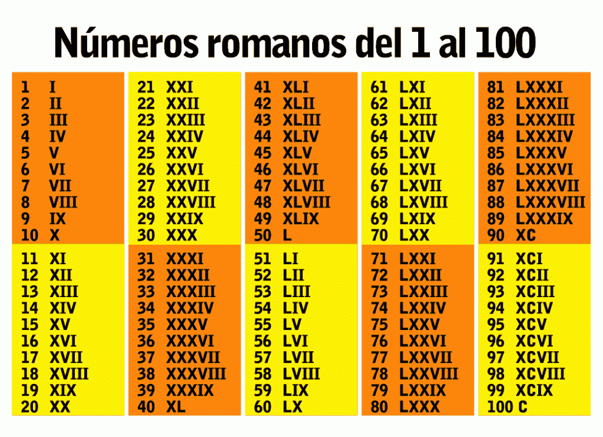
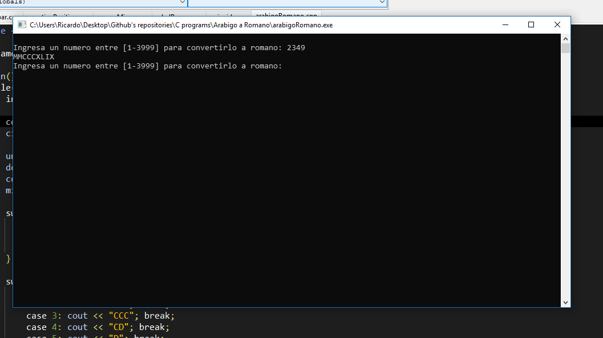

# Convertir-numeros-Arabigos-a-Romanos
## Del 1-3999
Este programa esta hecho en C++ y nos ayuda a convertir algun numero arabigo a romano, es muy facil de usar ademas, solo debes ingresar en el programa el numero que desees convertir y LISTO!!

#Ejemplo de uso :)
## 1. Ingresa numero
## 2. Listo!!

